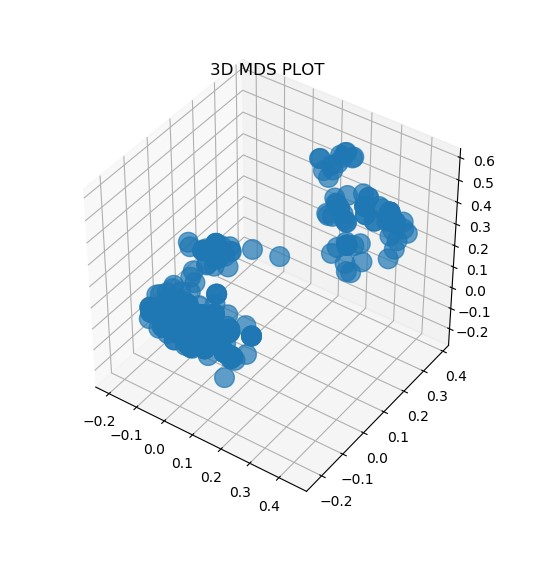

# Handling missing values with a random forest automatically
## For supervised learning

Random forest's definition of proximity is a solution that can be used to replace missing values in a dataset.

If you want to know more about how that implementation was done, you can read this article: https://medium.com/analytics-vidhya/replacing-missing-values-in-a-dataset-by-building-a-random-forest-with-python-d82d4ff24223

## Dependencies
- Python(version>=3.6)
- Numpy
- Pandas
- Matplolib
- Sklearn
- Tensorflow (version>=2.0)

## Instructions

- You can get the library with ***```pip install MissingValuesHandler```***

- Import a dataset

- Class instantiation: 'training_resilience' is a parameter that lets the algorithm know how many times it must keep searching for convergence when there are still some values that didn't converge 

- The type of **Random Forest is automatically handled**: if the target variable is numerical, a **RandomForestRegressor** is selected and if it is categorical, the algorithm will choose a **RandomForestClassifier**.

- Set up the parameters of the random forest except for the **criterion** since it is also taken care of by the software: it is **gini** or **entropy** for a random forest classifier and **mse** (mean squared error) for a regressor. 
- Set up essential parameters like the **number of iterations**, **the additional trees**, **the base estimator**…
- The method **train()** possesses three important arguments among others:
     - **forbidden_variables_list:** variables that don't require encoding will be put in that list
     - **ordinal_variables_list:** suited for ordinal categorical variables encoding
     - **n_iterations_for_convergence:** checks after n rounds if the predicted values converged. 4 or 5 rounds are usually enough

## Coding example:
```python
from MissingValuesHandler.missing_data_handler import MissingDataHandler
from os.path import join
from pandas import read_csv

"""
############################################
############# MAIN OBJECT ##################
############################################
"""
missing_data_handler = MissingDataHandler(training_resilience=3)


"""
############################################
############### RUN TIME ###################
############################################
"""
data = read_csv(join("data","Loan_approval.csv"), sep=",", index_col=False)
#Setting the ensemble model parameters: it could be a random forest regressor or classifier
missing_data_handler.set_ensemble_model_parameters(n_estimators=80, additional_estimators=20)

#Launching training and getting our new dataset
new_data = missing_data_handler.train(data=data, 
                                      target_variable_name="Loan_Status",  
                                      n_iterations_for_convergence=5,
                                      verbose=1,
                                      path_to_save_dataset=join("data", "Loan_approval_no_nan.csv"),
                                      forbidden_variables_list=["Credit_History"])


"""
############################################
########## DATA RETRIEVAL ##################
############################################
"""
features_type_prediction            = missing_data_handler.get_features_type_predictions()
target_variable_type_prediction     = missing_data_handler.get_target_variable_type_prediction()
encoded_features                    = missing_data_handler.get_encoded_features()
encoded_target_variable             = missing_data_handler.get_target_variable_encoded()
final_proximity_matrix              = missing_data_handler.get_proximity_matrix()
final_distance_matrix               = missing_data_handler.get_distance_matrix()
weighted_averages                   = missing_data_handler.get_all_weighted_averages()
convergent_values                   = missing_data_handler.get_convergent_values()
divergent_values                    = missing_data_handler.get_divergent_values()
ensemble_model_parameters           = missing_data_handler.get_ensemble_model_parameters()


"""
############################################
######## WEIGHTED AVERAGES PLOT ############
############################################
"""
missing_data_handler.create_weighted_averages_plots(directory_path="img", both_graphs=1, verbose=0)


"""
############################################
##########      MDS PLOT    ################
############################################
"""
mds_coordinates = missing_data_handler.get_mds_coordinates(n_dimensions=3)
missing_data_handler.show_mds_pot(mds_coordinates, plot_type="3d")
```

## 3d Multidimensional Scaling(MDS):
We can use the distance matrix to plot the samples and observe how samples are related to one another
 
