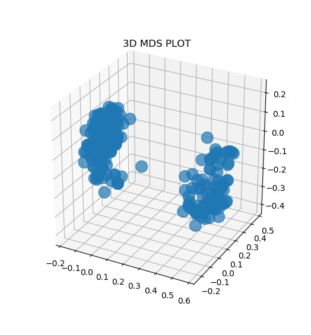

# Handling missing values with a random forest automatically
## For supervised and unsupervised learning

This library uses a random forest(regressor or classifier) to replace missing values in a dataset. It tackles:
- Samples having missing values in one or more features
- Samples having a missing target value and missing values in one or more features: both of them will be predicted and replaced.

Samples that only have a missing target value but none in the features can be predicted with another algorithm(the main one). So it will be better to put them in a test set since they won't be considered. The main idea is to use random forest's definition of proximity to find the values that are best fit to replace the missing ones.
    
## Dependencies
- Python(version>=3.6)
- Numpy
- Pandas
- Matplolib
- Sklearn
- Tensorflow (version>=2.0)

## Instructions

- You can get the library with ***```pip install MissingValuesHandler```***

- Import a dataset

- Class instantiation: **training_resilience** is a parameter that lets the algorithm know how many times it must keep searching for convergence when there are still some values that didn't converge 

- The type of **Random Forest is automatically handled**: if the target variable is numerical, a **RandomForestRegressor** is selected and if it is categorical, the algorithm will choose a **RandomForestClassifier**.

- Set up the parameters of the random forest except for the **criterion** since it is also taken care of by the software: it is **gini** or **entropy** for a random forest classifier and **mse** (mean squared error) for a regressor. 
- Set up essential parameters like the **number of iterations**, **the additional trees**, **the base estimator**…
- The method **train()** possesses three important arguments among others:
     - **forbidden_variables_list:** variables that don't require encoding will be put in that list
     - **ordinal_variables_list:** suited for ordinal categorical variables encoding
     - **n_iterations_for_convergence:** checks after n rounds if the predicted values converged. 4 or 5 rounds are usually enough

## Coding example:
```python
from MissingValuesHandler.missing_data_handler import RandomForestImputer
from os.path import join
from pandas import read_csv

"""
############################################
############# MAIN OBJECT ##################
############################################
"""
random_forest_imputer = RandomForestImputer(training_resilience=3)

"""
############################################
############### RUN TIME ###################
############################################
"""
data = read_csv(join("data","Loan_approval.csv"), sep=",", index_col=False)


#Setting the ensemble model parameters: it could be a random forest regressor or classifier
random_forest_imputer.set_ensemble_model_parameters(n_estimators=80, additional_estimators=20)

#Launching training and getting our new dataset
new_data = random_forest_imputer.train(data=data, 
                                      target_variable_name="Loan_Status",  
                                      n_iterations_for_convergence=5,
                                      verbose=1,
                                      path_to_save_dataset=join("data", "Loan_approval_no_nan.csv"),
                                      forbidden_variables_list=["Credit_History"])

"""
############################################
########## DATA RETRIEVAL ##################
############################################
"""
features_type_prediction            = random_forest_imputer.get_features_type_predictions()
target_variable_type_prediction     = random_forest_imputer.get_target_variable_type_prediction()
encoded_features                    = random_forest_imputer.get_encoded_features()
encoded_target_variable             = random_forest_imputer.get_target_variable_encoded()
final_proximity_matrix              = random_forest_imputer.get_proximity_matrix()
final_distance_matrix               = random_forest_imputer.get_distance_matrix()
weighted_averages                   = random_forest_imputer.get_all_weighted_averages()
convergent_values                   = random_forest_imputer.get_convergent_values()
divergent_values                    = random_forest_imputer.get_divergent_values()
ensemble_model_parameters           = random_forest_imputer.get_ensemble_model_parameters()
target_value_predictions            = random_forest_imputer.get_target_values_predictions()

"""
############################################
######## WEIGHTED AVERAGES PLOT ############
############################################
"""
random_forest_imputer.create_weighted_averages_plots(directory_path="graphs", both_graphs=1, verbose=1)


"""
############################################
######## TARGET VALUE(S) PLOT ##############
############################################
"""
random_forest_imputer.create_target_pred_plot(directory_path="graphs", verbose=1)


"""
############################################
##########      MDS PLOT    ################
############################################
"""
mds_coordinates = random_forest_imputer.get_mds_coordinates(n_dimensions=3)
random_forest_imputer.show_mds_plot(mds_coordinates, plot_type="3d")
```

## 3d Multidimensional Scaling(MDS):
We can use the **distance matrix** to plot the samples and observe how they are related to one another
 

We can use the **K-means algorithm** to cluster the data and analyze the features of every cluster


## References for the supervised algorithm:
- [1]: **Leo Breiman’s website**. Random Forests Leo Breiman and Adele Cutler **stat.berkeley.edu/~breiman/RandomForests/cc_home.htm**
- [2]: **John Starmer’s video** on Youtube Channel StatQuest. **Random Forests Part 2: Missing data and clustering** https://youtu.be/nyxTdL_4Q-Q
